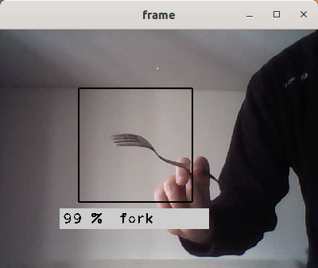

# Object prediction with webcam



Cutlery prediction in action.


## Usage

- start deep learning environment  with tensorflow keras installed (exemplary name):
	```
	conda activate my_deep_learning
	```

- start the program:

    ```
    python src/capture.py
    ```

- the program needs access to your webcam

- `1` - disable prediction if activated
- `2` - launch cutlery predictor model, based on MobileNet_V2 (fork, knife, spoon)
- `3` - launch object predictor model ResNet50, trained on the 1000 categories of ImageNet
- `s` - takes 224x224 pictures, saved in `images`
- `q` - exit the program
